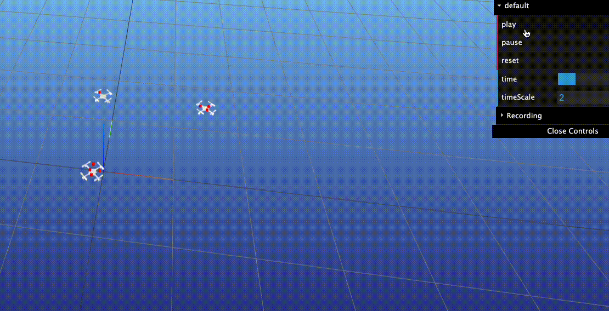

[](https://github.com/IMRCLab/librigidbodytracker/actions/workflows/cmake.yml)

# librigidbodytracker
This library helps to track (i.e. estimate the pose) of rigid-bodies.
It assumes that an initial estimate for the pose of each rigid body is given.
The new poses are estimated using the iterative closest point algorithm (ICP) frame-by-frame.



The library is used in the Crazyswarm project.

## Building

See `cmake.yml` workflow for a detailed list of instructions on how to build on Ubuntu.

## Usage

### Playback of a recording

A pointcloud can be recorded in a binary format, for example using the ROS motion capture package. This can be replayed:

```
./playclouds ../example/cfg_000.yaml ../example/recording_000
```

### Visualization (MeshCat HTML export)

Render rigidbody tracking results with the matching point cloud into a self-contained HTML animation using MeshCat.

Requirements:
- Python 3.8+
- `meshcat`, `numpy`

Install (optional venv recommended):
```
pip install meshcat numpy
```

Input expectations:
- Provide the full path to a rigidbody `.txt` file
- A point cloud file with the same base name must exist in the same directory: `<same_name>_pointcloud.txt`

Example:
- Rigidbody: `/path/to/data/figure8_3d_8m2.txt`
- Pointcloud: `/path/to/data/figure8_3d_8m2_pointcloud.txt`

Run from anywhere (paths resolved automatically):
```
python script/visualization_tracking/vis_pc_drones.py /absolute/or/relative/path/to/your_file.txt
```

Example:
```
python3 script/visualization_tracking/vis_pc_drones.py data_example/figure8_2d_5m1.txt
```

Output:
- `/path/to/data/your_file.html` (saved next to the inputs)
